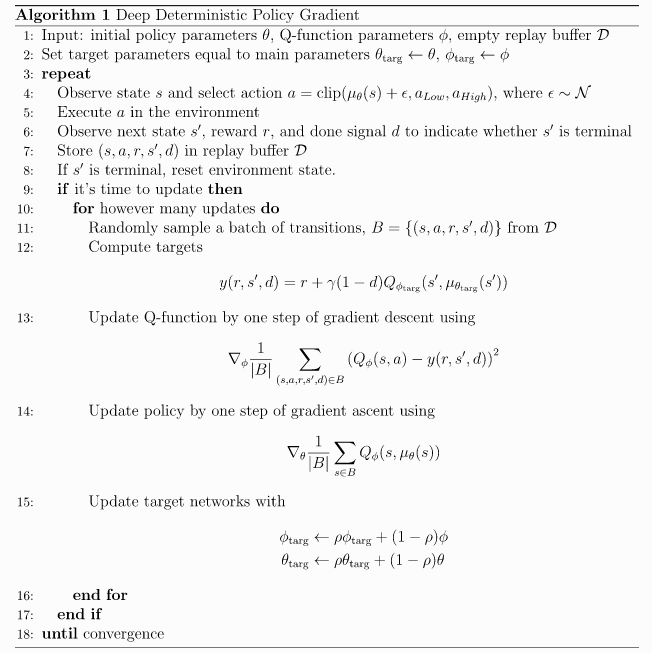
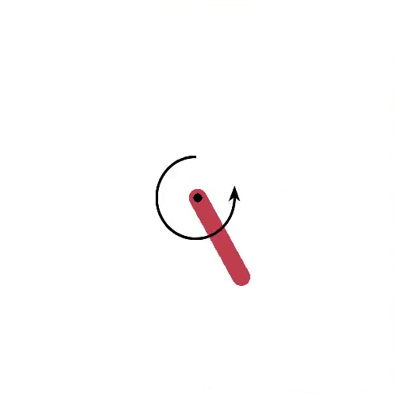

# Deep Deterministic Policy Gradients
This is an implementation of Deep Deterministic Policy Gradients as described in this [paper](https://arxiv.org/abs/1509.02971). DDPG is an actor-critic method designed for continous action spaces. I implemented it to work for the OpenAI gym's Pendulum environment where the agent must learn to invert and balance a pendulum. The agent can apply a torque on the joint at each time step to make the pendulum achieve its goal. The control signal is continuous which is a big change from the other Deep RL approaches I have worked on so far. You could try to discretize the space and apply DQN or DDQN but that would not likely scale well to higher dimensional problems! The key insight of DDPG is that the Q-function, mapping a (state, action) -> (value), is now differentiable with respect to the action. For an environment with discrete actions, our Q-function was discontinous with respect to the actions because they were disrcete. This allows us to have a gradient based method improve our policy function. For more details, check out the pseudo code below <br /> 

[]

# Results
### Mujoco Environments
The Mujoco Physics Simulator (Multi-Joint Dynamics with Contact) has a few OpenAI gym environments for simple robots with continuous control. I implemented DDPG with the same hyper parameters as the original DDPG [paper](https://arxiv.org/abs/1509.02971) and applied it to the Hopper-V2 and Cheetah environments <br />

Below is a gif of the Hopper's learned policy. A video is available at add link <br />
[]

(matplotlib plots) <br />


### Classic Control Environments
(matplotlib plots) <br />

Below is a gif of the learned policy <br />
[]


# Activating the Virtual Environment 
```source env_name/bin/activate``` <br />

# Setting Up Virtual Environment 
```python3 -m venv env_name``` <br /> 
```source env_name/bin/activate``` <br />
```pip3 install --upgrade pip``` <br />
```python3 -m pip install --upgrade setuptools``` <br />
```pip install tensorflow=2.0.0``` Make sure Tensorflow2, not Tensorflow1 is installed <br />
```pip install keras``` <br />
```pip install gast==0.2.2```  This fixes a issue reported by Tensorflow <br />

To setup Mujoco, follow these [instructions](https://www.chenshiyu.top/blog/2019/06/19/Tutorial-Installation-and-Configuration-of-MuJoCo-Gym-Baselines/) but instead of using an Anaconda virtual environment, use a Python virtual environment <br />

# Transfering Code to Beast
```scp -r -P 922 DDPG/ peterj@beast.mech.northwestern.edu:RL```
