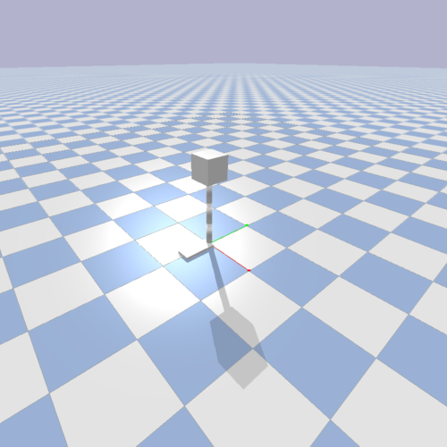
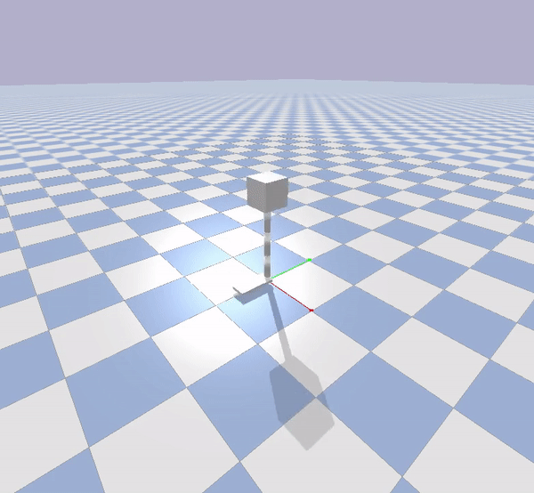
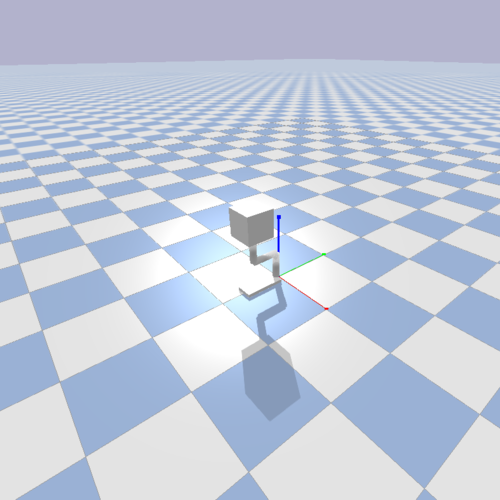

# Hopper-v2 Environment
I created my own OpenAI gym environment in PyBullet. I am working with [Dan Lynch](https://robotics.northwestern.edu/people/profiles/students/lynch-dan.html) to build a control system for a monoped on soft ground. Dan's PhD thesis is on optimal control of legged robots on soft ground. I got involved helping to build a neural network representation of how the robot's foot interacted with the ground. The research is motivated and further described in this [paper](https://ieeexplore.ieee.org/document/9018262). I helped build a granular simulation of sand-like material, gather a dataset, and use Keras to summarize the mapping in a neural network. I was also interested in seeing if a Deep Reinforcement Learning algorithm could learn to walk on the same soft ground in PyBullet. So. I created a urdf of Dan's robot and an OpenAI gym environment in PyBullet. 

## PyBullet Environment 
Dan's optimal controller is for a planar system so I made my PyBullet environment planar too. This should also make it easier for the agent to learn as it is one less degree of freedom to worry about. The robot is an open chain of three rods and a flat plate as a foot. Each joint is revolute. Pretty fancy robot! On the first iteration, the agent controlled the inputs to a positional PID controller at each joint. PyBullet then handled the PID controller to apply specific torques. In other words, I let the agent control it's joint positions. Future iterations could include the agent applying direct torque control of the motors at its joints. 

Below is an image of the robot as it is starting an episode in Bullet.  

# Reward Function
Creating a reward function for the robot to follow is pretty tough! The agent often finds an unexpected but valid way to get high scores but also not really accomplish your original, semantic goal. You get what you incentivize, not what you intend! The simplest way to incentivize the agent is to give very sparse rewards. This means the agent gets no real reward until it reaches the desired goal state of the Markov Decesion Process. The downside to this approach is that the sparsity of the reward signal makes it much harder for the agent to learn. It needs to stumble upon the goal state a few times before it can learn to reach it. A good idea is to have some more regular rewards to nudge the agent toward the desired goal state. In our case, we want the Hopper robot to learn how to translate itself in the forward X direction. We could give intermediate rewards which are proportional to the agent's X-position. Although, this can have some unintended consequences. The agent learns to launch itself in the forward X direction rather than hopping, landing, and hopping again. Below is a gif of the launching policy.     
As an outside observer, we know the best policy is to hop, land, and repeat. The agent found a local minimum of the loss function and can spend quite a while there before it finds a lower minimum elsewhere in the weight space.  

So! You're probably thinking, why not incentivize the agent to stay alive as well. So the agent's reward would be some function of it's X-position and the number of steps in the epoch. This is a good idea but also prone to errors. The agent learns that if it stands still, it can collect reward indefinitely. . So, we must find some delicate balance between staying alive and moving forward. Add this to the list of hyper-parameters for Deep Reinforcement Learning algorithms!   

# Notes on Creating a Custom Gym Environment 
A great tutorial of how to create a custom gym environment can be found [here](https://medium.com/@apoddar573/making-your-own-custom-environment-in-gym-c3b65ff8cdaa)

# Bullet Documentation
The PyBullet documentation can be found [here](https://docs.google.com/document/d/10sXEhzFRSnvFcl3XxNGhnD4N2SedqwdAvK3dsihxVUA/edit#)

## DDPG Implementation
I used a 3 layer neural network with batch normalization at each layer. I 

## hopper_agent.py
This is the implementation of DDPG tuned for the custom Hopper environment.  
 

## replayBuffer.py
This is the replay buffer memory for the hopper agent. 