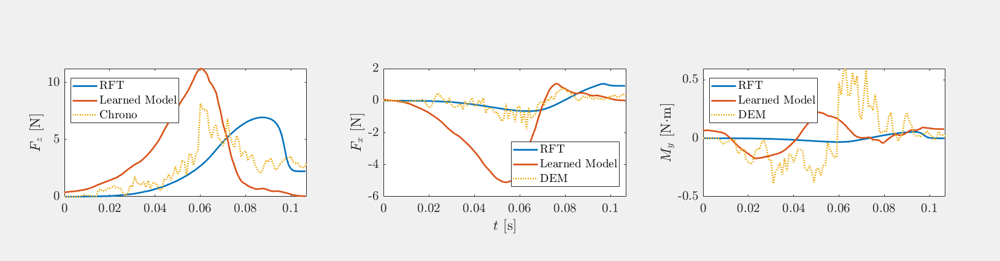
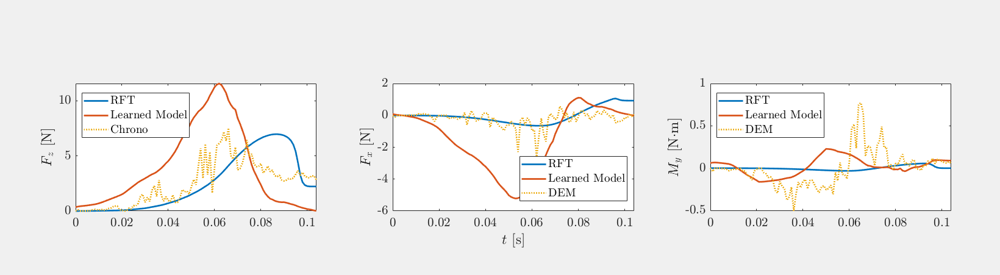
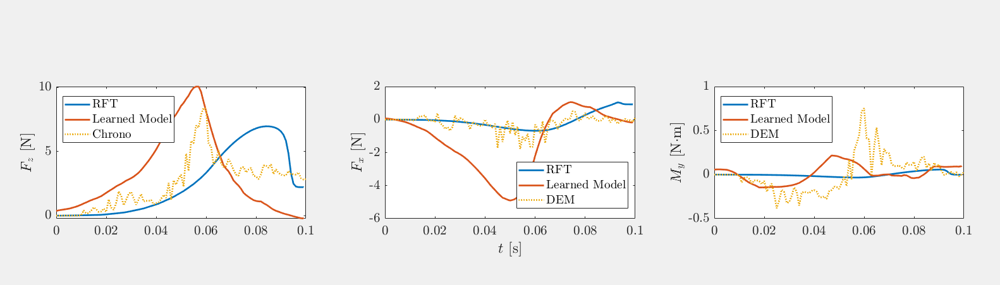
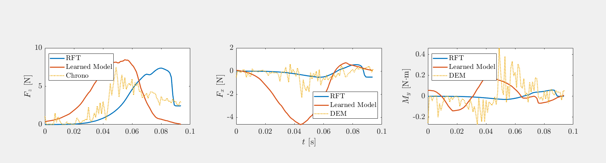
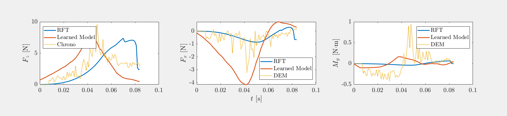
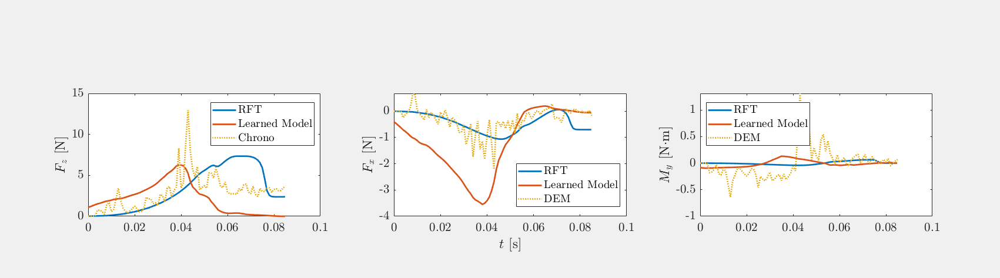
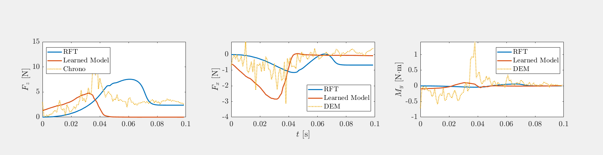
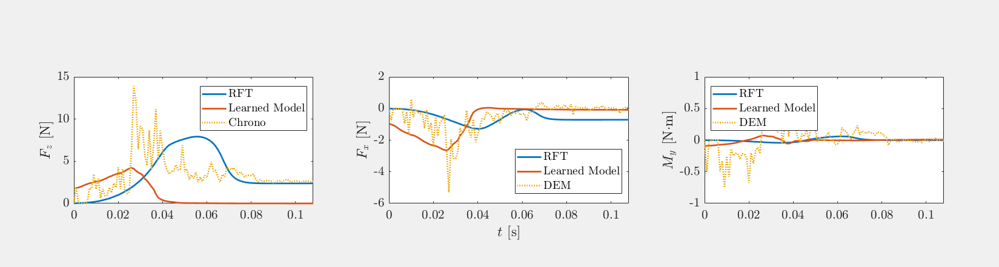

# Description
This directory has everything required for comparing the neural network ground reaction model to the DEM data and the RFT data.  

# Dataset
The dataset Juntao and Dan used over the summer should go in the dataset folder. There are 4-5 simulations worth of DEM simulations with each one having the plate hit the ground at diffrent speeds. The plate is not driven or forced into the granular material. The dataset files are too big for me to commit because of Github's size limits. I zipped the folder and put it in my google drive. Here is the link to the folder, https://drive.google.com/file/d/1bKOJLMaauMwVOnheWvTxcKUSMF-ULI9f/view?usp=sharing  

# How to Recreate My Graphs
In Matlab, run <br /> 
```init_env.m```, ```init_params.m``` then run ```eval_foot_gpm("path_to_simulation_data")``` <br />

The path_to_simulation_data is the global path to one of the directories in the dataset/unforced_gpm/ directories. For example, on my computer, in Matlab, I would run ```eval_foot_gpm("/home/peterjochem/Desktop/Deep_RL/DDPG/h3pper/createGroundModel/validateModel/DEM_RFT_Comparisons/dataset/unforced_gpm/data_set/v_minus_5")```. This will do the comparisons of both models and the ground truth simulation data for a single simulation of the experiment. Each experiment uses a diffrent velocity and so you need to run ```eval_foot_gpm("path_to_simulation_data") ``` on each directory in dataset/unforced_gpm/data_set/ to view how the model performs across a wide range of velocities. 

# Results

 <br />

 <br />

 <br />

 <br />

 <br />

 <br />

 <br />

 <br />


# Files in Repo 
```eval_foot_gpm.m```: Highest level Matlab code for comparing the DEM data, RFT models, and neural network models of the ground. <br />   

```groundReactionModel1.m```: Matlab class for a neural network mapping [gamma, beta, depth] -> [ground reaction force x, ground reaction force z, torque] <br />

```groundReactionModel2.m```: Matlab class for a neural network mapping [gamma, beta, depth, velocity_x, velocity_z] -> [ground reaction force x, ground reaction force z, torque] <br /> 

```init_env.m```: Matlab file that must be run before running eval_foot_gpm.m <br />

```init_params.m```: Matlab file that must be run before running eval_foot_gpm.m <br />

```README.md```

     
