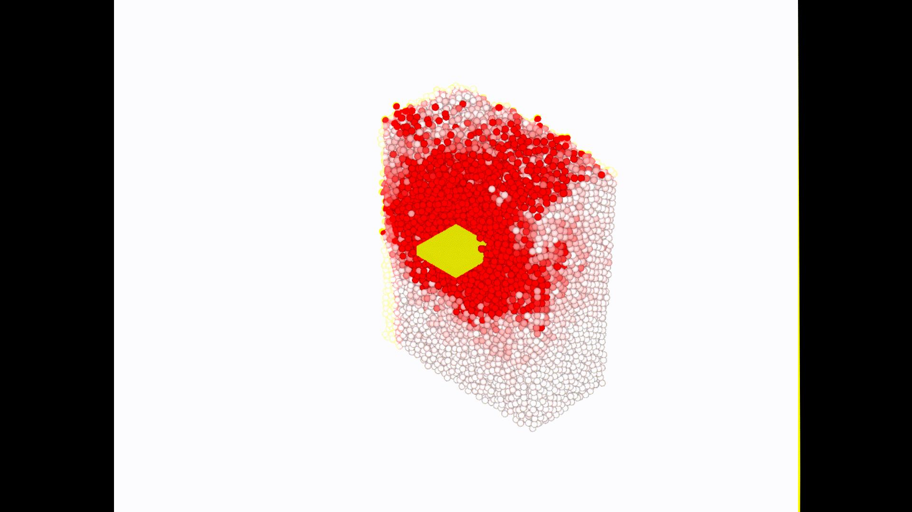
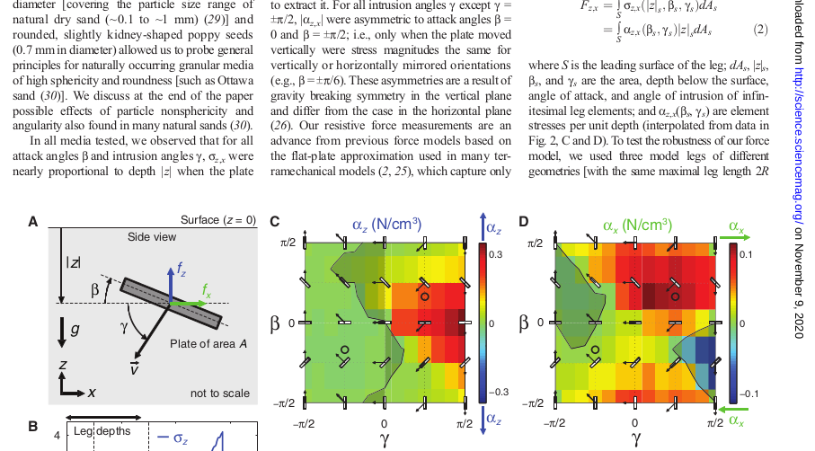
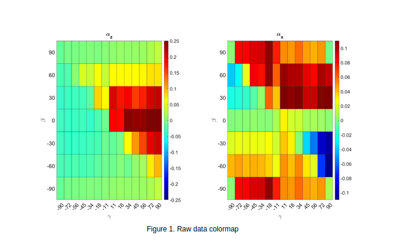
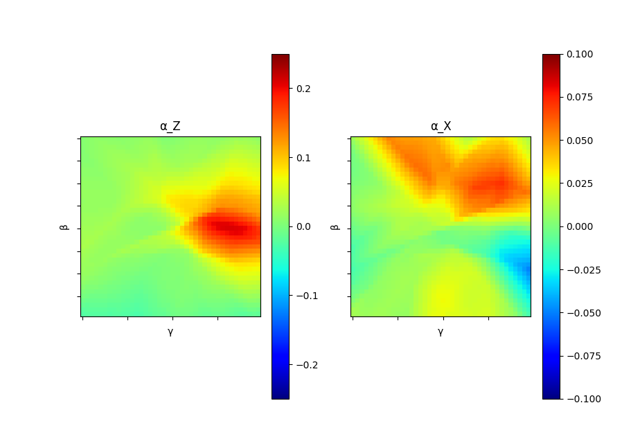
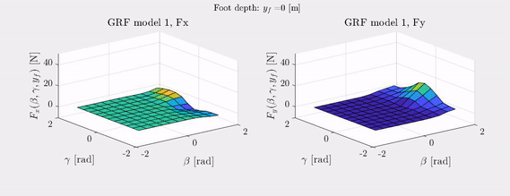

# Description 
This directory holds the code and data for comparing our neural network model's learned mapping to the experimental data collected by the Chen Li group. 
<br />

# Results
I trained a neural network to map (gamma, beta) -> (stress-x/depth, stress-z/depth)

### Input Space Parameters 
gamma (degrees): The angle at which the foot is intruding into the ground. <br />
beta (degrees) - The foot's orientation in the x-z plane <br />
depth (cm) - The foot's depth into the granular material <br />
<br />
### Output Space Description
stress x (N/cm^2) - The stress in the x-direction that the ground exerts on the foot <br />
stress z (N/cm^2) - The stess in the z-direction that the ground exerts on the foot <br />

# Dataset 
Juntao replicated Chen Li's physical experiment in a DEM simulation. He used the simulation to generate a dataset. One execution of Juntao's code had a fixed gamma value and varied the beta value. So a single run of the executable had a few iterations of the following: the granular material settles, the foot resets to a home postion, and the foot intrudes into the granular material. On each iteration of the previous cycle, a new beta value was used. Generating a dataset over the space we care about requires editing the program to have a diffrent gamma values, recompiling, and re-running. I later automated the above steps so that we can run one executable and it generates data over the entire space of parameters we care about. The dataset I used to create the graphs is from Juntao's simulations. On each run of his executable, he created a new csv file to record gamma, beta, depth, and stresses. I wrote a simple script to take each of the csv files (1 for each run of the exectuable) and combine them into one big csv file. This utility script is called ```createOneDataSet.py```. In it, you simply need to specify the names of the csv files you want to combine and it creates one big csv file called compiledSet.csv. This is then used as the dataset for the neural network to learn from. <br />

Below is a visualization Juntao created of what the simulated environment looks like. The red and white spheres are granular material. The yellow square is the plate. One cannot see this, but there is a container that holds the granular material. <br />


# Files in Repo
```processData.py```: This creates a neural network, trains it on the dataset, and displays the learned mapping in a style similiar to the data in the Chen Li paper. <br />
```createOneDataSet.py```: This is a utility to take many csv files of the same format and combine them into one csv file. <br />
```visualize.m```: This visualizes the learned model's mapping as the foot intrudes into the material <br />  
```dataset```: This folder has the many csv files Juntao generated to make the dataset. It also has the csv file which is the combination of all the other csv files. I am unable to commit the csv files themselves because of Github's file size limits. So, (here)[https://drive.google.com/file/d/1KkP-1wS5JZlekcDpJVncy3schVZpl43l/view?usp=sharing] is a link to the same data. The link is to a zip file of the folder.
<br />  
```media```: This has pictures useful for describing the setup and the results. <br /> 
```README.md```  

# Results 
The first image is from Chen Li's [Terradynamics paper](https://arxiv.org/abs/1303.7065). They ran physical experiments to measure the stress per unit depth of a plate as it is driven into granular material. Juntao replicated the physical experiment in a DEM simulation and gathered the same data. Below is an image of the (filtered) raw data from the Chronos simulations. This data was filtered to only contain data points with a depth in the interval of (X, Y). This data is very similiar to the physical experimental data collected by the Chen Li group.    

 <br />
Graph1: Chen Li's experimental data <br /> <br />

 <br />
Graph2: Juntao's DEM simulation data <br /> <br />

 <br />
Graph3: Neural Network's learned representation of the DEM dataset <br />
The dataset for generating the plots of the model's predictions as we increase the depth is slightly diffrent. This data is available [here](../../DEM_RFT_Comparisons/dataset/neural_net_data). This is the dataset I have been using to train the neural networks in the ../../DEM_RFT_Comparisons code.
<br /> <br />

# How Does The Model Vary over Depth?
I trained a neural network to map (gamma, beta, depth) -> (ground reaction force-x, ground reaction force-z). This can then be used to look into how the model's forces change as the plate is driven furter into the granular material. Dan helped me create a visualization in Matlab of the model's mapping as the plate goes to deeper depths. Below is the visualization <br/> 
 <br />
Graph4: Neural Network's learned representation as the foot's depth increases <br /> <br /> 

# How to Replicate What I Did
In order to make a neural network, train it on the dataset, and create plots (Graph3 above) to compare with the Terradynamics paper plots (Graph1 above), run ```python3 createOneDataSet.py``` and then ```python3 processData.py``` <br />

In order to create the visualization of the ground model as the plate is driven further into the material, you need to first run the steps above to create a neural network and train it on the dataset. This will create a model.h5 file. This is a file format describing the networks architecture and weights. You then need to open ```groundReactionModel.m``` in Matlab and insert the new path to the model.h5 file. To generate the visualization, you then run in Matlab, ```visualize.m```     

