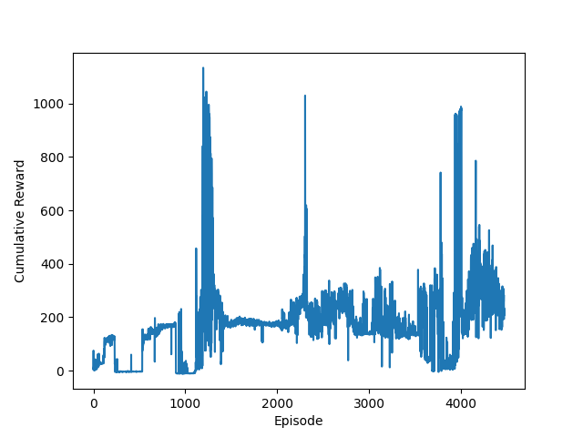

# Hopper-v2 Environment
The Mujoco Physics Simulator (Multi-Joint Dynamics with Contact) has a few OpenAI gym environments for simple robots with continuous control. I implemented DDPG with the same hyper parameters as the original DDPG [paper](https://arxiv.org/abs/1509.02971) and applied it to the Hopper-V2 and Cheetah environments. The Hopper and Cheetah environments feature robots who must learn what torques to apply to their motors in order to produce forward translation.  

The agent's learned policy is pretty unstable! It has short periods where it hops really well but then some weight updates push it toward pretty poor gaits. The neural networks are pretty shallow right now. Hopefully a larger network would be more robust. Another approach could be to reduce the action space noise or to move away from action space noise and instead use parameter space noise. Below is the agent's cumulatative reward per episode of training. The agent's learned policy is pretty unstable! It has short periods where it hops really well but then some weight updates push it toward pretty poor gaits. The neural networks are pretty shallow right now. Hopefully a larger network would be more robust. Another approach could be to reduce the action space noise or to move away from action space noise and instead use parameter space noise. A video of the Hopper learning is available [here](https://youtu.be/E0tvLX5sxv0?t=281).  
Learned Policy             |  Reward Per Epoch over Time
:-------------------------:|:-------------------------:
  | 

 
