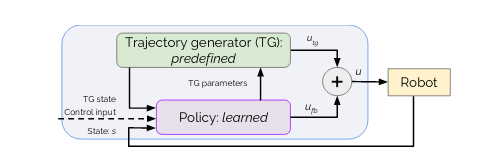
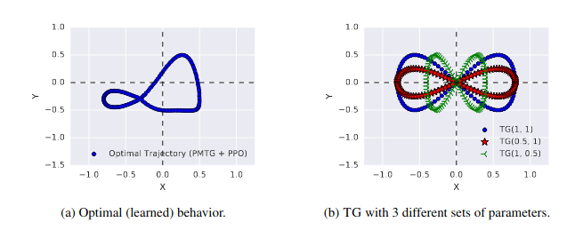
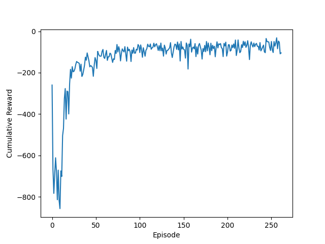
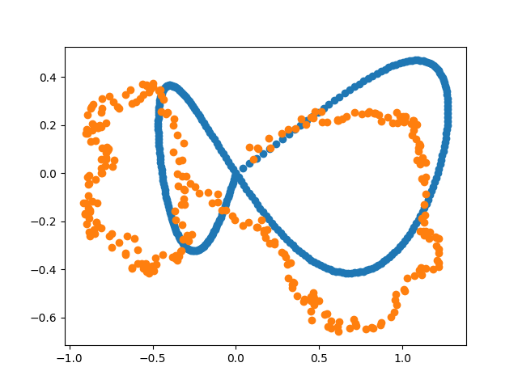
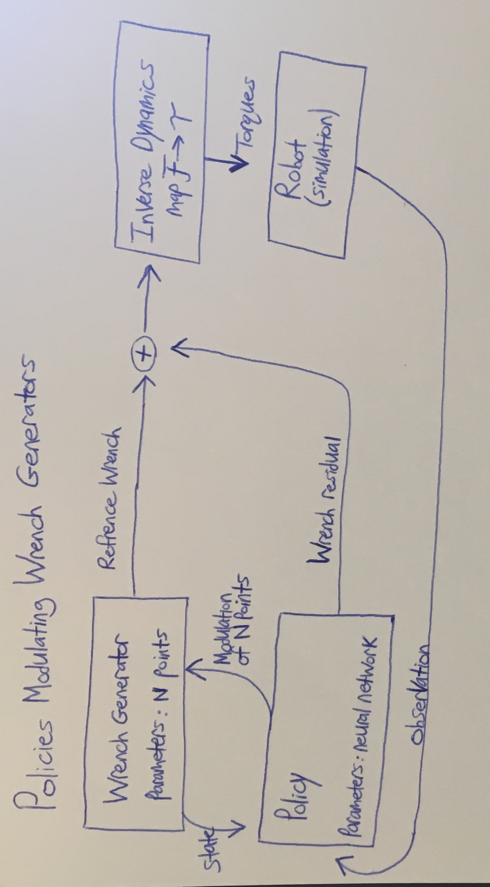

# Policies Modulating Trajectories (PMTG)
This is an implementation of policies modulating trajectories (PMTG) as described in this [paper](https://arxiv.org/abs/1910.02812).

# Issues Addressed by Policies Modulating Trajectory Generators 
Deep learning for control in simulated environments is an exciting area of research. Many people have succesfully learned policies in simulated environments and then succesfully deployed them onto real hardware. Although, these methods require a ton of computing resources and often learn brittle control policies. Researchers have tried to address this by using more complicated function approximators like recurrent neural networks. Another approach has been to try to incorporate prior knowledge into the machine learning problem. Some have used classical controllers and then used RL on top of it to some success. For example, you might have a classical controller's output be modulated by a neural network running DDPG to learn how to control a robot's motors. PMTG is very similiar to this but takes it a step further. PMTG has an RL algorithm learn how to control not the robot directly but a new dynamical system - that of the robot and its trajectory generator. Our trajectory generator has some internal parameters it uses to compute a series of states the robot should be in. The controller could be some sort of optimal controller that requires in depth modelling of the environment and its dynamics or simply some sort of function that capture's the designer's intuiton about what a stable trajectory might look like. From experience with legged animals, we have a general idea about what the motion of a quadruped's legs is like. We want to avoid having the neural networks learn the entire control policy from scratch. So, PMTG lets the overall control signal that is sent to the robot be a sum of the trajectory generator and a modulation term from the neural network. PMTG also lets the RL agent modulate the internal parameters of the trajectory generator. The RL agent is learning how to control the system that is the robot, and its controller. This is in constrast to Vanilla DDPG, TD3, or PPO where we directly try to learn how to control the robot. 

# Results on PMTG Paper Problem 
The PMTG author's describe a toy problem for illustrating their approach. Suppose we have perfect position control over a ball moving on a plane and we had some sort of deformed figure-eight path we wanted the ball to follow over time. Since we know the optimal path for the ball is roughly a figure eight shape, we could create a trajectory generator that leads to a figure eight shape. This figure eight shape would have parameters controlling the width and height of the loops. At each time step, the trajectory generator outputs an (x, y) position for the ball. The RL agent can modulate this (x, y) control signal and also set the internal parameters of the trajectory generator. A control diagram for the system is below.  
  

The author's optimal path and trajectory generators are shown below  
  

I created a similiar environment and used a PMTG architecture with DDPG to learn a path through the environment. The blue, warped figure eight is the optimal path and the orange path is the learned path. 
Reward Per Epoch over Time |  Learned Policy
:-------------------------:|:-------------------------:
  | 

# H3pper Robot PMTG 
I am working on implementing a PMTG architecture for the hopper robot in PyBullet. Here is the initial architecture.  
 

