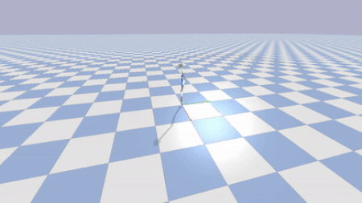
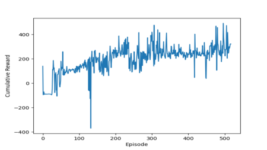

# Deep Reinforcement Learning
This repo is a collection of deep reinforcement learning algorithms implemented with Tensorflow and Keras. I think deep reinforcement learning has a lot of promise for robotic manipulation and just find it fascinating. I created a folder for each algorithm I implemented. So far, I have implemented Deep Q Learning (DQN), Double Deep Q Learning (DDQN), Deep Deterministic Policy Gradients (DDPG), and TD3. I also created a custom OpenAI gym environment of a hopping robot on soft ground. 

# Results 
More details about each algorithm and its results can be found in the README.md for each directory. Here are a few of the highlights so far though.
## Continuous Control with DDPG and TD3
The Mujoco Physics Simulator (Multi-Joint Dynamics with Contact) has a few OpenAI gym environments for simple robots with continuous control. I implemented DDPG with the same hyper parameters as the original DDPG [paper](https://arxiv.org/abs/1509.02971) and applied it to the Hopper-V2 and Cheetah environments. The Hopper and Cheetah environments feature robots who must learn what torques to apply to their motors in order to produce forward translation.  

Below is a gif of the Hopper's learned policy. A video is available [here](https://youtu.be/E0tvLX5sxv0?t=281)  

Below is a gif of the Cheetah's learned policy. A video is available [here](https://youtu.be/DQCQSEspLhs)  

### DDPG/TD3 - Custom OpenAI Gym Environment in PyBullet 
I created my own custom gym environment in PyBullet. I wanted to simulate a hopping robot walking on soft ground. PyBullet does not support granular materials in this sense so I simulated the robot's foot interacting with granular materials in Chrono, gathered a dataset, and trained a neural network to map the robot's state to the ground reaction forces and moments of torque. I then used this neural network to apply forces and torques on the robot's foot as it interacted with the bed of granular material. I still need to add a way to visualize where in space the granular material is. Below is a gif of the robot in its home position. A video of the robot hopping can be found [here](https://youtu.be/-Q_36Qi5CVc). More details can be found in the h3pper directory.  
Custom PyBullet Environment             |  Reward Per Epoch over Time
:-------------------------:|:-------------------------:
  | 

### Policies Modulating Wrench Generators - Custom OpenAI Gym Environment in PyBullet -
I created my own custom gym environment in PyBullet for a [policies modulating trajectory generators](https://arxiv.org/abs/1910.02812) architecture. [Dan Lynch](https://robotics.northwestern.edu/people/profiles/students/lynch-dan.html) has done a lot of amazing work on creating optimal controllers for legged robots. He created an optimal wrench generator for a generic monoped on soft ground. We created simulations of how robot feet interact with soft ground in DEM simulations. From this dataset, we trained a neural network to represent the soft ground reaction forces in PyBullet. We first used DDPG and TD3 to learn a walking policy. Then, we created a PMTG architecture. Describe the PMTG results here. 

## DDQN on Atari Environments 
I am in the process of implementing RL algorithms with convolutional neural networks to run on the Atari gym environments. This is where I will give a brief description and gif of those results. 

