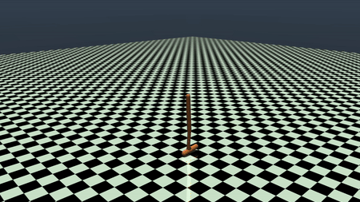
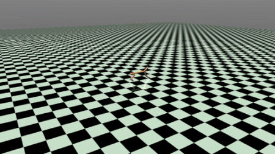

# Deep Reinforcement Learning
This repo is a collection of deep reinforcement learning algorithms implemented with Tensorflow and Keras. I think deep reinforcement learning has a lot of promise for robotic manipulation and just find it fascinating. I created a folder for each algorithm I implemented. So far, I have implemented Deep Q Learning (DQN), Double Deep Q Learning (DDQN), and Deep Deterministic Policy Gradients (DDPG). 

# Results 
More details about each algorithm and its results can be found in the README.md for each directory. Here are a few of the highlights so far though.
## DDPG
The Mujoco Physics Simulator (Multi-Joint Dynamics with Contact) has a few OpenAI gym environments for simple robots with continuous control. I implemented DDPG with the same hyper parameters as the original DDPG [paper](https://arxiv.org/abs/1509.02971) and applied it to the Hopper-V2 and Cheetah environments. The Hopper and Cheetah environments feature robots who must learn what torques to apply to their motors in order to produce forward translation.  

Below is a gif of the Hopper's learned policy. A video is available [here](https://youtu.be/E0tvLX5sxv0?t=281)  
[]

Below is a gif of the Cheetah's learned policy. A video is available [here](https://youtu.be/DQCQSEspLhs)  
[]

## DDQN on Atari Environments 
I am in the process of implementing RL algorithms with convolutional neural networks to run on the Atari gym environments. This is where I will give a brief description and gif of those results. 

